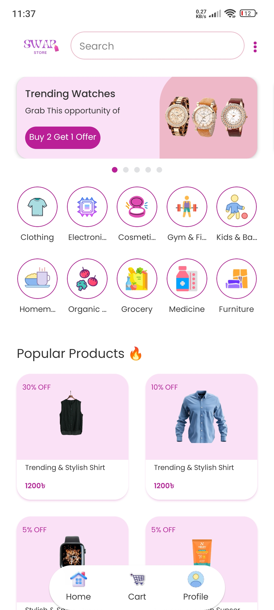
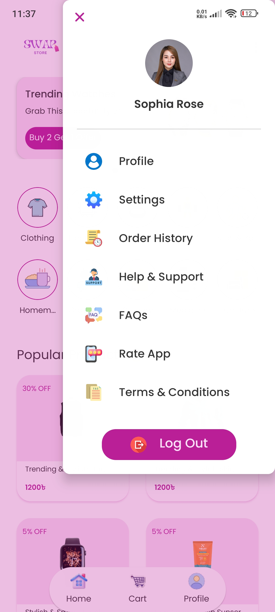
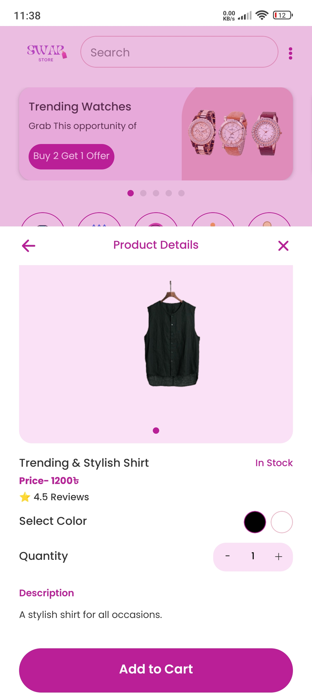
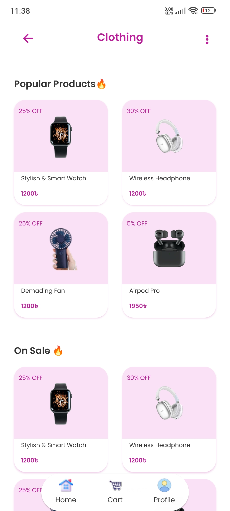

# 🛍️ Swap Store

A modern and user-friendly e-commerce mobile application built with **React Native** and **Expo**.  
The app provides a smooth shopping experience with onboarding, authentication, dynamic category browsing, product listings, and a fully functional cart and checkout system.

---

## ✨ Features

- **Auth Loading** – Automatically skips onboarding/login for authenticated users.  
- **Login / Sign Up** – PIN-based authentication system.  
- **Persistent Login** – Credentials stored securely in **AsyncStorage** until logout.  
- **Dynamic Categories** – Single screen supports multiple categories dynamically.  
- **Product Listing** – Includes *Popular* and *On-Sale* product sections.  
- **Cart & Checkout** – Managed efficiently with the Context API.  

---

## 🛠 Tech Stack

- **React Native (Expo)** – Cross-platform mobile development.  
- **React Navigation (Native Stack)** – Smooth navigation between screens.  
- **AsyncStorage** – Persistent local storage.  
- **Expo Font** – Custom font integration.  
- **Ionicons** – Icon set for modern UI.  
- **Custom Theme (`theme.js`)** – Centralized color and typography system.  
- **Centralized API (`api.js`)** – Clean and maintainable data management.  

---

## 📸 Screenshots

<p align="center">
  
  
  
  
</p>

---

## 🎥 Demo Video

<p align="center">
  <video src="assets/vdo.mp4" width="300" controls></video>
</p>

---

## 🚀 Setup & Installation

```bash
# Install dependencies
npm install
# or
yarn install
```


## License

This project is licensed under the [LICENSE NAME] License. See the `LICENSE` file for details.


